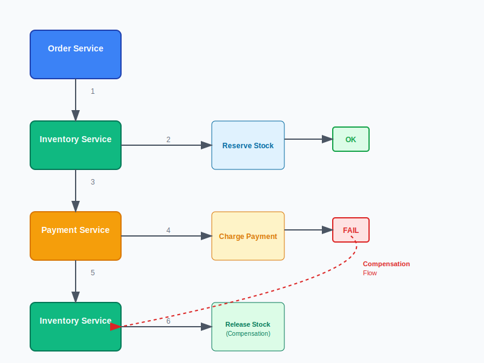
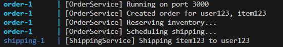
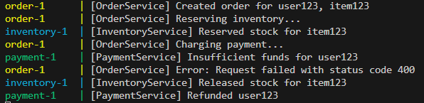
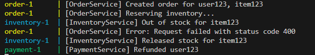

# Saga Design Pattern in Microservices (with Node.js Example)


📌 Recap: What is the Saga Pattern?

A **Saga** is a series of **local transactions**. If one transaction fails, compensating transactions are executed to undo the changes made by the previous ones.

---

## 🛍 Real-World Use Case: E-Commerce Order

### Services Involved:

1. **Order Service** – starts the saga.
  
2. **Inventory Service** – reserves or releases stock.
  
3. **Payment Service** – charges or refunds the user.
  
4. **Shipping Service** – arranges delivery.
  

---

## 🧑‍💻 Tech Stack (Simplified):

- Node.js (Express.js)
  
- PostgreSQL integration via pg for storing order status

- Compensation logic with database updates

- REST-based communication (for simplicity)

- Structured logging for observability

- No message queues in this basic example (but ideally use Kafka, RabbitMQ, or Temporal for real-world apps)
  

---

## ✅ Features

- Modular **service structure** (Order, Inventory, Payment, Shipping)
  
- **REST-based orchestrator**
  
- **Dockerized** using `Dockerfile` and `docker-compose.yml`
  
- Simplified in-memory state for demonstration
  
- **Logs & graceful error handling**
  

---

## 🗂 Directory Structure

```
saga-orchestrator-node/
├── docker-compose.yml
├── order-service/
│   ├── Dockerfile
│   ├── server.js
├── inventory-service/
│   ├── Dockerfile
│   ├── server.js
├── payment-service/
│   ├── Dockerfile
│   ├── server.js
├── shipping-service/
│   ├── Dockerfile
│   ├── server.js
```

---

## 1. 🧾 `docker-compose.yml`

```yaml
version: '3.8'    
services:
  order:
    build: ./order-service
    ports:
      - "3000:3000"
    depends_on:
      - inventory
      - payment
      - shipping

  inventory:
    build: ./inventory-service
    ports:
      - "3001:3001"

  payment:
    build: ./payment-service
    ports:
      - "3002:3002"

  shipping:
    build: ./shipping-service
    ports:
      - "3003:3003"
```

---

## 2. 🧱 `Dockerfile` (shared across services)

Place this in each service folder (`order-service/`, `inventory-service/`, etc.)

```Dockerfile
FROM node:24-alpine

WORKDIR /app

COPY package*.json ./
RUN npm install

COPY . .

EXPOSE 3000

CMD ["node", "server.js"]
```

---

## 3. 📦 `package.json` (for all services)

Use this or adjust per service:

```json
{
  "name": "saga-service",
  "version": "1.0.0",
  "main": "server.js",
  "scripts": {
    "start": "node server.js"
  },
  "dependencies": {
    "axios": "^1.6.0",
    "express": "^4.18.2"
  }
}
```

---

## 4. 🧑‍💻 `order-service/server.js`

```js
const express = require('express');
const axios = require('axios');
const app = express();
app.use(express.json());

const BASE = {
  inventory: 'http://inventory:3001',
  payment: 'http://payment:3002',
  shipping: 'http://shipping:3003'
};

app.post('/create-order', async (req, res) => {
  const { productId, userId } = req.body;
  try {
    console.log('Step 1: Reserving inventory...');
    await axios.post(`${BASE.inventory}/reserve`, { productId });

    console.log('Step 2: Charging payment...');
    await axios.post(`${BASE.payment}/charge`, { userId });

    console.log('Step 3: Scheduling shipping...');
    await axios.post(`${BASE.shipping}/ship`, { userId, productId });

    res.status(200).send('Order completed successfully.');
  } catch (err) {
    console.error('Error occurred. Starting compensation...');
    try {
      await axios.post(`${BASE.inventory}/release`, { productId });
      await axios.post(`${BASE.payment}/refund`, { userId });
    } catch (compErr) {
      console.error('Compensation failed:', compErr.message);
    }
    res.status(500).send('Order failed. Compensation triggered.');
  }
});

app.listen(3000, () => console.log('Order Service running on port 3000'));
```

---

## 5. 📦 Other Services

### `inventory-service/server.js`

```js
const express = require('express');
const app = express();
app.use(express.json());

let stock = { item123: 10 };

app.post('/reserve', (req, res) => {
  const { productId } = req.body;
  if (stock[productId] > 0) {
    stock[productId]--;
    console.log(`Stock reserved for ${productId}`);
    res.send('Reserved');
  } else {
    res.status(400).send('Out of stock');
  }
});

app.post('/release', (req, res) => {
  const { productId } = req.body;
  stock[productId]++;
  console.log(`Stock released for ${productId}`);
  res.send('Released');
});

app.listen(3001, () => console.log('Inventory Service on port 3001'));
```

### `payment-service/server.js`

```js
const express = require('express');
const app = express();
app.use(express.json());

let balance = { user123: 1000 };

app.post('/charge', (req, res) => {
  const { userId } = req.body;
  if (balance[userId] >= 100) {
    balance[userId] -= 100;
    console.log(`Charged user ${userId}`);
    res.send('Charged');
  } else {
    res.status(400).send('Insufficient funds');
  }
});

app.post('/refund', (req, res) => {
  const { userId } = req.body;
  balance[userId] += 100;
  console.log(`Refunded user ${userId}`);
  res.send('Refunded');
});

app.listen(3002, () => console.log('Payment Service on port 3002'));
```

### `shipping-service/server.js`

```js
const express = require('express');
const app = express();
app.use(express.json());

app.post('/ship', (req, res) => {
  const { userId, productId } = req.body;
  console.log(`Shipping ${productId} to user ${userId}`);
  res.send('Shipped');
});

app.listen(3003, () => console.log('Shipping Service on port 3003'));
```

---

## 🧑‍💻 Example Use Case: E-Commerce Order Processing

Step-by-step flow using the Saga Pattern:

#### 1. Orchestrator sends `CreateOrder` request.

#### 2. Inventory Service reserves stock and responds.

#### 3. Orchestrator calls Payment Service.

- If payment succeeds, proceed.
  
- If payment fails, call Inventory Service to **release the stock** (compensating action).
  

#### 4. Orchestrator calls Shipping Service to create a shipment.





---

## 🚀 Running the System

### 1. Build and start all services

```bash
docker-compose up --build
```

### 2. Test the Saga

```bash
curl -X POST http://localhost:3000/create-order \
  -H "Content-Type: application/json" \
  -d '{"productId": "item123", "userId": "user123"}'
```



You can test failure scenarios by:

- Setting `balance['user123'] = 0` in `paymentService.js`

  
  
- Setting `stock['item123'] = 0` in `inventoryService.js`

  

---

## 🧠 Final Thoughts

The **Saga Pattern** is essential in distributed systems when you can’t use traditional database transactions. It’s like having a **“backup plan”** for each step in your business process — especially useful when things go wrong.

As you dive deeper into microservices, understanding and applying the Saga Pattern will help you build **robust, resilient**, and **fault-tolerant** applications.

This example is intentionally simple, but it introduces the key ideas you’ll need to build more robust implementations using proper orchestration tools or event-driven designs.

---

## 👨‍💻 Author
#Enjoy Coding (Began BALAKRISHNAN) ❤️

---
